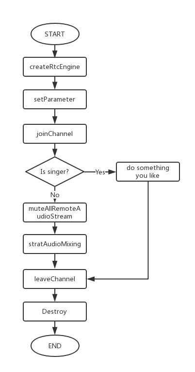

# Agora Online Chorus

*其他语言版本： [简体中文](README.md)*

The Agora Android Chorus Sample App is an open-source demo that will help you get voice chat directly into your Android applications using the Agora Voice SDK.

With this sample app, you can:

- Join / leave channel
- Play a role as a player
- Play a role as a singer

## Get SDK
Contact BD to get the SDK. For details, contact sales@agora.io or 4006326626。

## API Call Sequence



## Running the App
First, create a developer account at [Agora.io](https://dashboard.agora.io/signin/), and obtain an App ID. Update "app/src/main/res/values/strings.xml" with your App ID.

```
<string name="agora_app_id"><#YOUR APP ID#></string>
```


Finally, open project with Android Studio, connect your Android device, build and run.

Or use `Gradle` to build and run.

## Developer Environment Requirements
- Android Studio 3.1 or above
- Real devices (Nexus 5X or other devices)
- Some simulators are function missing or have performance issue, so real device is the best choice

## Connect Us
- You can find full API document at [Document Center](https://docs.agora.io/en/)
- You can file bugs about this demo at [issue](https://github.com/AgoraIO-Community/Agora-Online-Chorus/issues)

## License
The MIT License (MIT).
