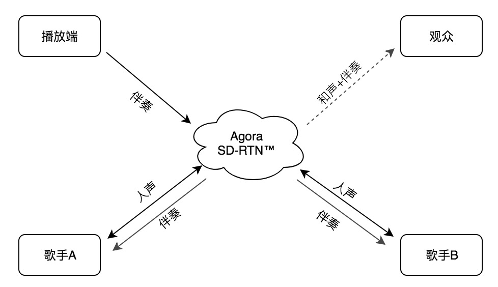
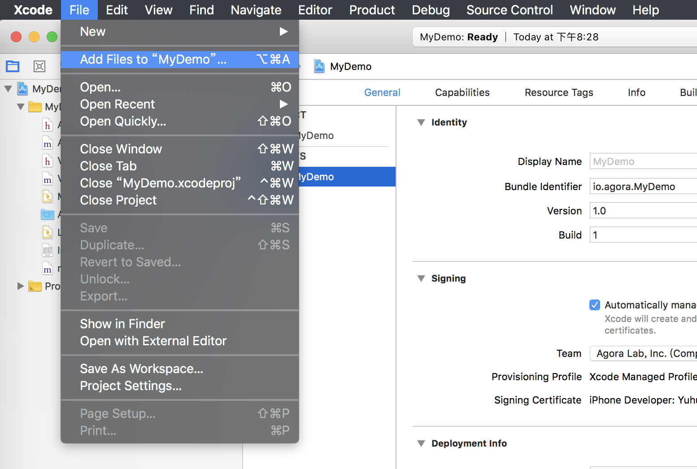
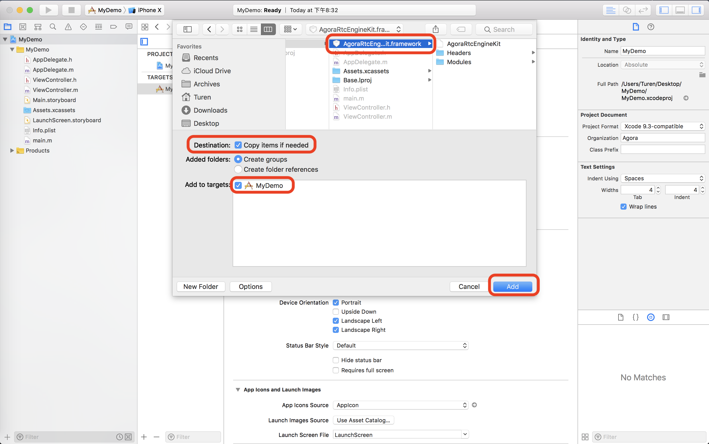

# 在线合唱：从方案到集成

Other Language: [English](README.md)

声网 SDK 提供在线合唱解决方案，主要包括:

* 场景描述
* 实现方案
* 集成方法 - Android
* 集成方法 - iOS
* 常见问题
* 进阶指南

## 场景描述

* 发起人点歌，并发起合唱；
* 音乐播放端通过网络同时发送给多位合唱者；
* 合唱者在线合唱，并能同步听到彼此的声音；

# 实现方案

下图为在线合唱场景的实现架构图：

     


在这个架构图中：

* 音乐播放器端加入 SD-RTN；
* 伴奏音乐通过 SD-RTN 实时同步发送给合唱者 A 和 B；
* 合唱者 A 和 B 会同时听到伴奏，合着伴奏开始演唱；
* SD-RTN 会实时地将 A 的歌声传给 B 端，同样的 B 的歌声也会被实时地传输到 A 端；

声网已在 GitHub 提供了 Android 和 iOS 平台的 [实现代码](https://github.com/AgoraIO/Agora-Online-Chorus/) 。

## 集成方法 - Android

集成方法章节主要包含:

* 集成 SDK
* 加入声网频道实现音频通话

### 集成 SDK

#### 步骤 1：准备环境

1. 联系声网商务下载 Android 平台合唱 SDK。详情请洽 sales@agora.io ，电话 4006326626。

2. 请确保满足以下开发环境要求:

    * Android SDK API Level> = 16

    * Android Studio 2.0 或以上版本

    * 支持语音和视频功能的真机

    * App 要求 Android 4.1 或以上设备

3. 请确保在使用 Agora 相关功能及服务前，已打开特定端口，详见 [防火墙说明](https://docs.agora.io/cn/2.4/product/Interactive%20Broadcast/Agora%20Platform/firewall?platform=All%20Platforms) 。


#### 步骤 2: 添加 SDK

1. 将下载的软件包中 *libs* 文件夹下的库根据实际需求拷贝到您项目对应的文件夹里。

   * agora-rtc-sdk.jar (mandatory)

   * armeabi-v7a/

   * x86/

   * arm64-v8a

**注意:** 当你将所需库复制到正确路径的 *libs* 文件夹里时，如果该路径包含中文，则无法成功编译，报错中会提到 ASCII 码。

2. 请根据您项目的 *build.gradle* 文件里的设置，将上述库放入正确路径的 *libs* 文件夹下。例如:

     


3. 请在 build.gradle 文件里指定 so 文件的目录，即上一步里面 libs 文件夹的路径。

     

#### 步骤 3: 配置 NDK

如果出现以下问题，请配置 NDK:

     


该错误表示没有安装 NDK。请从网站上下载，请将其放在与 Android SDK 平行的路径下:

     


#### 步骤 4: 添加权限

为保证 SDK 正常运行，程序部署时需在 *AndroidManisfest.xml* 文件中加入以下许可：

```
   <uses-permission android:name="android.permission.INTERNET" />

   <uses-permission android:name="android.permission.RECORD_AUDIO" />

   <uses-permission android:name="android.permission.MODIFY_AUDIO_SETTINGS" />

   <uses-permission android:name="android.permission.ACCESS_NETWORK_STATE" />
```

#### 步骤 5：同步项目文件

点击 **Sync Project With Gradle Files** ，直到同步完成。

     


#### 步骤 6：混淆代码

当您在写混淆代码时，请添加以下代码:

     

### 加入声网频道实现音频通话

首先申请 App ID，详见 [获取 App ID](https://docs.agora.io/cn/2.4/product/Interactive%20Broadcast/Agora%20Platform/token?platform=All%20Platforms) 。

#### 音乐播放端

1. 创建 RtcEngine 对象，并填入 App ID，详见 [create()](https://docs.agora.io/cn/2.4/product/Interactive%20Broadcast/API%20Reference/live_video_android?platform=Android)。

 ```

   public static synchronized RtcEngine create(Context context,
                                                String appId,
                                                IRtcEngineEventHandler handler);
 ```

2. 设置频道为通信模式，详见 [setChannelProfile()](https://docs.agora.io/cn/2.4/product/Interactive%20Broadcast/API%20Reference/live_video_android?platform=Android) 。

 ```
   public abstract int setChannelProfile(int profile);
 ```
3. 创建并加入频道, 详见 [joinchannel()](https://docs.agora.io/cn/2.4/product/Interactive%20Broadcast/API%20Reference/live_video_android?platform=Android) 。

 ```

   public abstract int joinChannel(String token,
                                   String channelName,
                                   String optionalInfo,
                                   int optionalUid);
 ```

4. 开始播放伴奏，详见 [startAudioMixing()](https://docs.agora.io/cn/2.4/product/Interactive%20Broadcast/API%20Reference/live_video_android?platform=Android) 。

 ```

   public abstract int startAudioMixing(String filePath,
                                        boolean loopback,
                                        boolean replace,
                                        int cycle);
 ```

5. 离开频道 (leaveChannel)，详见 [leaveChannel()](https://docs.agora.io/cn/2.4/product/Interactive%20Broadcast/API%20Reference/live_video_android?platform=Android) 。

 ```

   public abstract int leaveChannel();

 ```
**注意:** 伴奏音量应小于人声。

6. 离开频道，详见 [leaveChannel()](https://docs.agora.io/cn/2.4/product/Interactive%20Broadcast/API%20Reference/live_video_android?platform=Android) 。

#### 歌手端

1. 创建 RtcEngine 对象，并填入 App ID，详见 [create()](https://docs.agora.io/cn/2.4/product/Interactive%20Broadcast/API%20Reference/live_video_android?platform=Android) 。

 ```

   public static synchronized RtcEngine create(Context context,
                                                String appId,
                                                IRtcEngineEventHandler handler);
 ```

2. 设置频道为通信模式，详见 [setChannelProfile()](https://docs.agora.io/cn/2.4/product/Interactive%20Broadcast/API%20Reference/live_video_android?platform=Android) 。

 ```

   public abstract int setChannelProfile(int profile);

 ```
3. 为歌手端设置低延时策略：

 ```

   mRtcEngine.setParameters("{\"che.audio.enable.androidlowlatencymode\": true}");
   mRtcEngine.setParameters("{\"che.audio.enable.androidlowlatencymode\": true}");
   mRtcEngine.setParameters("{\"che.audio.start_debug_recording\":\"111\"}");
   mRtcEngine.setParameters("{\"che.audio.codec.name\":\"OPUSFB\"}");
   mRtcEngine.setParameters("{\"rtc.resend_lowlatency\":1}");
   mRtcEngine.setParameters("{\"che.audio.neteq.maxdelay\":20}");
   mRtcEngine.setParameters("{\"che.audio.neteq.mindelay\":0}");

 ```
4. 创建并加入频道, 详见 [joinchannel()](https://docs.agora.io/cn/2.4/product/Interactive%20Broadcast/API%20Reference/live_video_android?platform=Android) 。

 ```

   public abstract int joinChannel(String token,
                                   String channelName,
                                   String optionalInfo,
                                   int optionalUid);
 ```
5. 离开频道 (leaveChannel)，详见 [leaveChannel()](https://docs.agora.io/cn/2.4/product/Interactive%20Broadcast/API%20Reference/live_video_android?platform=Android) 。

 ```

   public abstract int leaveChannel();

 ```

## 集成方法 - iOS

### 集成 SDK

#### 步骤 1: 准备环境

1. 联系声网商务下载 iOS 平台合唱 SDK。详情请洽 sales@agora.io ，电话 4006326626。

2. 请确保满足以下开发环境要求:

    * Apple Xcode 9.0 或以上版本
    * iOS 10.0 或以上版本
    * 支持语音功能的真机设备

#### 步骤 2: 添加 Agora SDK

1. 打开 Xcode 项目，选择 **File** > **Add Files to ...**

2. 在弹出的文件选择框中选择第 1 步解压出的 *AgoraRtcEngineKit.framework* 文件。

     


3. 按需勾选 **Copy items if needed**。

4. 注意在下方 **Add to targets** 中勾选对应的 target。

5. 点击 **Add** 按钮

     


#### 步骤 3: 访问库

在 viewController.h 文件里，添加 *#import <AgoraAudioKit/AgoraRtcEngineKit.h>* , 即可开始使用 iOS 平台的合唱 SDK。

#### 步骤 4: 设置 App 的音频设备使用权限

使用 Agora SDK 前，App 需要麦克风授权:

在 *info.plist* 进行授权操作: 添加 **Privacy - Microphone Usage Description** 字段

#### 步骤 5: 其他设置

设置后台模式。在 **Background Modes** 里选择 **Audio, AirPlay, and Picture in Picture** 。

### 加入声网频道实现语音通话

首先申请 App ID，详见 [获取 App ID](https://docs.agora.io/cn/2.4/product/Interactive%20Broadcast/Agora%20Platform/token?platform=All%20Platforms) 。

#### 音乐播放端

1. 创建 RtcEngine 对象，并填入 App ID，详见 [sharedEngineWithappId](https://docs.agora.io/cn/2.4/product/Interactive%20Broadcast/API%20Reference/live_video_ios?platform=iOS) 。

2. 设置频道为 **通信模式**，详见 [setChannelProfile](https://docs.agora.io/cn/2.4/product/Interactive%20Broadcast/API%20Reference/live_video_ios?platform=iOS) 。

3. 创建并加入频道, 详见 [joinChannelByToken](https://docs.agora.io/cn/2.4/product/Interactive%20Broadcast/API%20Reference/live_video_ios?platform=iOS) 。

4. 静音所有远端音频，详见 [muteAllRemoteAudioStreams](https://docs.agora.io/cn/2.4/product/Interactive%20Broadcast/API%20Reference/live_video_ios?platform=iOS) 。

5. 开始播放伴奏，详见 [startAudioMixing](https://docs.agora.io/cn/2.4/product/Interactive%20Broadcast/API%20Reference/live_video_ios?platform=iOS) 。

**注意:** 伴奏音量应小于人声。

6. 离开频道，详见 [leaveChannel](https://docs.agora.io/cn/2.4/product/Interactive%20Broadcast/API%20Reference/live_video_ios?platform=iOS) 。


#### 歌手端

1. 创建 RtcEngine 对象，并填入 App ID，详见 [sharedEngineWithappId](https://docs.agora.io/cn/2.4/product/Interactive%20Broadcast/API%20Reference/live_video_ios?platform=iOS) 。

2. 设置频道为 **通信模式**，详见 [setChannelProfile](https://docs.agora.io/cn/2.4/product/Interactive%20Broadcast/API%20Reference/live_video_ios?platform=iOS) 。

3. 为歌手端设置低延时策略：

```
agoraKit.setParameters("{\"che.audio.lowlatency\":true}")
agoraKit.setParameters("{\"rtc.lowlatency\":1}")
```
4. 创建并加入频道, 详见 [joinChannelByToken](https://docs.agora.io/cn/2.4/product/Interactive%20Broadcast/API%20Reference/live_video_ios?platform=iOS) 。

5. 离开频道 (leaveChannel)，详见 [leaveChannel](https://docs.agora.io/cn/2.4/product/Interactive%20Broadcast/API%20Reference/live_video_ios?platform=iOS) 。


## 常见问题

### 弱网情况下人声有卡顿

为了保证合唱的实时性，歌手客户端采用了低延时策略，弱网下丢包率会相应增加。

#### 出现回声

歌手需要带耳机合唱，不能通过外放。


## 进阶指南

### 耳返接口:

Android:

* 启用耳返功能, 详见 [enableInEarMonitoring()](https://docs.agora.io/cn/2.4/product/Interactive%20Broadcast/API%20Reference/live_video_android?platform=Android) 。
* 设置耳返音量，相见 [setInEarMonitoringVolume](https://docs.agora.io/cn/2.4/product/Interactive%20Broadcast/API%20Reference/live_video_android?platform=Android)  。

iOS:

* 启用耳返功能, 详见 [enableInEarMonitoring()](https://docs.agora.io/cn/2.4/product/Interactive%20Broadcast/API%20Reference/live_video_ios?platform=iOS) 。
* 设置耳返音量，相见 [setInEarMonitoringVolume](https://docs.agora.io/cn/2.4/product/Interactive%20Broadcast/API%20Reference/live_video_ios?platform=iOS)  。


### 调整伴奏音量：

* Android: 音乐播放端直接调整音量，详见 [adjustAudioMixingVolume()](https://docs.agora.io/cn/2.4/product/Interactive%20Broadcast/API%20Reference/live_video_android?platform=Android) 。

* iOS: 音乐播放端直接调整音量，详见 [adjustAudioMixingVolume()](https://docs.agora.io/cn/2.4/product/Interactive%20Broadcast/API%20Reference/live_video_ios?platform=iOS) 。
